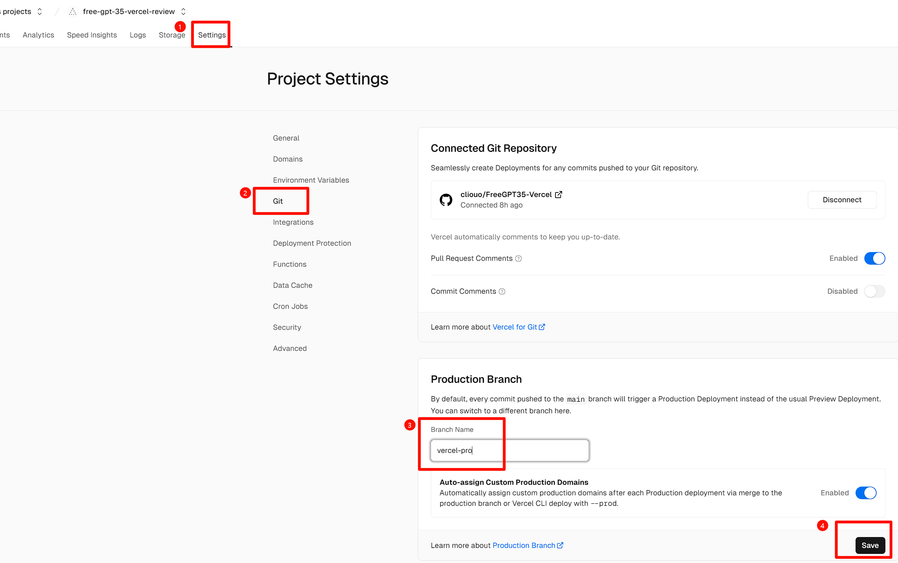
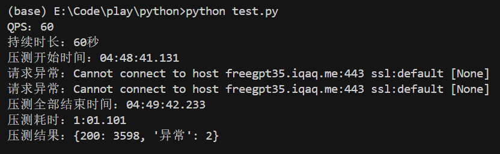
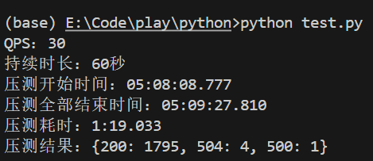

> [!WARNING]
> ## Vercel部署此路有严重限制，玩玩就好，真用还是得docker。
> ## 还是看看远处的[aurora](https://github.com/aurora-develop/aurora)吧家人们
- 限制原因:
Vercel的流式响应并不是一开始写流，客户端就能立刻收到响应流，而是先写到一个缓冲区，当流关闭才一股脑的流式响应回来(不是实时流)
- 因此导致:
超过10s之后才要关闭的流，通通接收不到。(因为Vercel免费版持续时间最大值10秒)
- 解决办法:
氪金!!! Vercel Pro 超时上限为300s，Pro用户部署完成后，到Vercel的`Setting`->`Git`->`Production Branch`填写为`vercel-pro`然后`Save`保存后部署该分支即可获得300s超时上限。

#### 不过，玩玩沉浸式翻译，把`每次请求最大文本长度`调小一点不超时的话，还是不错的。 (自定义域名的情况下)
#### Vercel的并发大概有==50-60QPS==。即使是中小段落翻译任务，并发依然稳在==30QPS==
#### 并发测试水平: 
##### 短对话: 
```
{"role": "user", "content": content: "Say this is a test!"}
```

##### 日常翻译:
```
[{"role": "system", "content": "你是一个专业,地道的翻译引擎，你只返回译文，不含任何解释"},
{"role": "user", "content": "将下面 YAML 格式的文本中的 text 字段翻译为 Simplified Chinese Language，并将翻译结果写在 text 字段中\n\nExample request:\n  - id: 1\n    text: Source\nExample result:\n  - id: 1\n    text: Translation\n\n开始翻译:\n\n- id: 1\n  text: The Philippines' official vessels infringed on China's rights, made provocations in the disguise of fishery protection, and organized media to hype up misinformation, which undermined stability in the South China Sea, he noted.\n- id: 2\n  text: Any tactic infringing on China's rights is futile, he warned.\n- id: 3\n  text: The CCG will carry out regular rights protection and law enforcement operations in waters under China's jurisdiction, and resolutely safeguard the country's territorial sovereignty and maritime rights and interests, he said."}]
```

---------------------
## Vercel一键部署

<a href="https://vercel.com/import/project?template=https://github.com/cliouo/FreeGPT35-Vercel" target="_blank" rel="noopener noreferrer"></a>

**绑定自定义域名解决Vercel域名被阻断问题**

### Variables
| Key         | Default Value                          | Note                                      |
|-------------|----------------------------------------|-------------------------------------------|
| `AUTH_TOKEN`|          any_string_you_like           | This is your API key for accessing FreeGPT35. |

--------------------

## 以下为原项目文档:

[![Docker Pulls][1]](https://hub.docker.com/r/missuo/freegpt35)

[1]: https://img.shields.io/docker/pulls/missuo/freegpt35?logo=docker

Utilize the unlimited free **GPT-3.5-Turbo** API service provided by the login-free ChatGPT Web.


> [!IMPORTANT]  
> **If you are unable to use this project normally, it is most likely due to issues with your IP. Your IP has triggered Cloudflare's shield, or has already been banned. Please try to change your IP or switch servers on your own. 如果您无法正常使用此项目，很可能是由于您的 IP 存在问题。您的 IP 已触发了 Cloudflare 的盾，或已被 ban 掉。请尝试自行更改您的 IP 或切换服务器。**

## Please READ the following content carefully!
- Please do not use the IP provided by proxy providers, otherwise you probably won't be able to use it. 请不要使用机场的 IP，不然你大概率无法使用。
- Do not make frequent requests, such as using **immersive translate**. 不要频繁请求，例如使用沉浸式翻译。
- Recommended to use US home broadband IP, you are very likely to succeed. 推荐使用美国家宽IP，你很大可能可以成功。
- Don't share and abuse your API. 不要共享和滥用你的 API。

## Deploy

### Node

```bash
npm install
node app.js
```
### Docker

```bash
docker run -p 3040:3040 ghcr.io/missuo/freegpt35
```

```bash
docker run -p 3040:3040 missuo/freegpt35
```

### Docker Compose

#### Only FreeGPT35 Service

```bash
mkdir freegpt35 && cd freegpt35
wget -O compose.yaml https://raw.githubusercontent.com/missuo/FreeGPT35/main/compose.yaml
docker compose up -d
```

#### FreeGPT35 Service with [ChatGPT-Next-Web](https://github.com/ChatGPTNextWeb/ChatGPT-Next-Web):

```bash
mkdir freegpt35 && cd freegpt35
wget -O compose.yaml https://raw.githubusercontent.com/missuo/FreeGPT35/main/compose_with_next_chat.yaml
docker compose up -d
```

After deployment, you can directly access `http://[IP]:3040/v1/chat/completions` to use the API. Or use `http://[IP]:3000` to directly use **ChatGPT-Next-Web**.

### Nginx Reverse Proxy

```nginx
location ^~ / {
        proxy_pass http://127.0.0.1:3040; 
        proxy_set_header Host $host; 
        proxy_set_header X-Real-IP $remote_addr; 
        proxy_set_header X-Forwarded-For $proxy_add_x_forwarded_for; 
        proxy_set_header REMOTE-HOST $remote_addr; 
        proxy_set_header Upgrade $http_upgrade; 
        proxy_set_header Connection "upgrade"; 
        proxy_http_version 1.1; 
        add_header Cache-Control no-cache; 
        proxy_cache off;
        proxy_buffering off;
        chunked_transfer_encoding on;
        tcp_nopush on;
        tcp_nodelay on;
        keepalive_timeout 300;
    }
```

### Nginx Reverse Proxy with Load Balancer

```nginx
upstream freegpt35 {
        server 1.1.1.1:3040;
        server 2.2.2.2:3040;
}

location ^~ / {
        proxy_pass http://freegpt35; 
        proxy_set_header Host $host; 
        proxy_set_header X-Real-IP $remote_addr; 
        proxy_set_header X-Forwarded-For $proxy_add_x_forwarded_for; 
        proxy_set_header REMOTE-HOST $remote_addr; 
        proxy_set_header Upgrade $http_upgrade; 
        proxy_set_header Connection "upgrade"; 
        proxy_http_version 1.1; 
        add_header Cache-Control no-cache; 
        proxy_cache off;
        proxy_buffering off;
        chunked_transfer_encoding on;
        tcp_nopush on;
        tcp_nodelay on;
        keepalive_timeout 300;
    }
```

## Request Example

**You don't have to pass Authorization, of course, you can also pass any string randomly.**

```bash
curl http://127.0.0.1:3040/v1/chat/completions \
  -H "Content-Type: application/json" \
  -H "Authorization: Bearer any_string_you_like" \
  -d '{
    "model": "gpt-3.5-turbo",
    "messages": [
      {
        "role": "user",
        "content": "Hello!"
      }
    ],
    "stream": true
    }'
```

## Compatibility

You can use it in any app, such as OpenCat, Next-Chat, Lobe-Chat, Bob, etc. Feel free to fill in an **API Key** with any string, for example, `gptyyds`.

### Bob


## Credits
- Forked From: [https://github.com/skzhengkai/free-chatgpt-api](https://github.com/skzhengkai/free-chatgpt-api)
- Original Author: [https://github.com/PawanOsman/ChatGPT](https://github.com/PawanOsman/ChatGPT)

## License
MIT License
