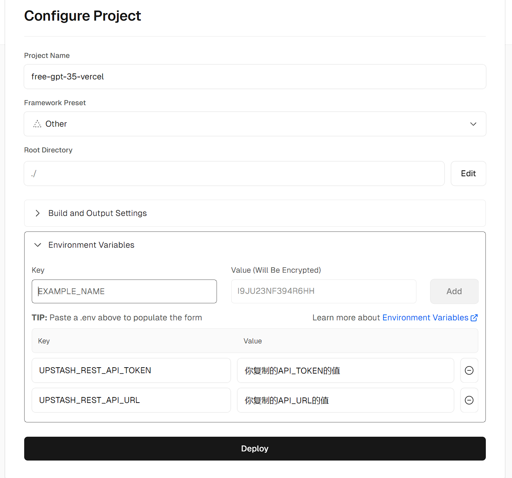
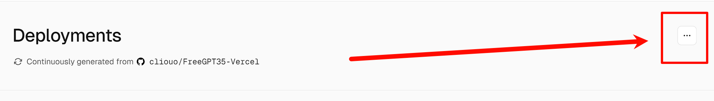

# 我Vercel又复活啦!!!!!! 已支持==流式响应==!!!!!! (把Express丢了)
# 并发这次也确实提高了, 之前确实测得不准，这次真够用了
### ChatGPT Next Web 测试 
当然这么长的回复10s肯定发不完

#### 依然存在的问题
- 超过10s之后会断流。(因为Vercel免费版持续时间最大值10秒)
#### 解决办法:
氪金!!! Vercel Pro 超时上限为300s，[跳转Pro部署介绍](#3-vercel-pro-计划的尊贵用户移除请求最大持续时间10s上限)

---------------------
## Vercel部署按钮 
**==不推荐==，无法同步更新，并且新版需要数据库了，==点了也还需要配置数据库步骤==**

[](https://vercel.com/new/clone?repository-url=https%3A%2F%2Fgithub.com%2Fcliouo%2FFreeGPT35-Vercel&skippable-integrations=1)


--------------------

## Deploy
#### 以下均建议绑定自定义域名解决Vercel域名被阻断问题
### 1. 结合 [Vercel](https://vercel.com/) 的`KV`数据库部署 (kv数据库每天只有3k次、每月30k次访问，仅够个人低频率使用)
1. fork 本仓库，fork时，取消勾选 `Copy the main branch only`
2. 进入Vercel，导入您fork的仓库
3. 点击`Deploy`，等待部署完成
4. 进入`Storage`选项卡，创建一个`KV`数据库，`Database Name`随便起，`Primary Region`区域推荐选`San Francisco`，点击`Create`
5. 务必确认`kv`数据库的`Projects`选项卡连接了你的项目
6. (可选) 在`Settings`的`Domains`下绑定你自己的域名。
7. 转到顶部`Deployments`选项卡，`Redeploy`重新部署你的项目
8. 完成! 鼓掌

--------------------

### 2. 结合 [Upstash](https://upstash.com/) 的`Redis`数据库部署 (每天10k次访问) 推荐!
[官方文档](https://upstash.com/docs/redis/overall/getstarted)
1. 跳转到`Upstash`创建并登录您的账户，创建一个`Redis`数据库
2. `Region` 推荐选 `California, USA`，`Eviction`勾选，然后创建

1. 注意`UPSTASH_REST_API_URL`和`UPSTASH_REST_API_TOKEN`，等下要复制这两对数据名和数据的值，这两对数据等下要在`Vercel`的`Environment Variables`里填入

1. fork 本仓库，fork时，取消勾选 `Copy the main branch only`
2. 在vercel中导入您fork的仓库
3. 在 `Environment Variables` 输入框中填入 第3步 的两对数据

1. 点击`Deploy`
2. (可选) 在`Settings`的`Domains`下绑定你自己的域名。
3. 转到顶部`Deployments`选项卡，`Redeploy`重新部署你的项目
4. 完成! 鼓掌

--------------------

### 3. `Vercel Pro` 计划的尊贵用户，移除请求最大持续时间10s上限
1. 前几步部署和上述两种计划相同，按需选择
2. 只需在最后`Redeploy`重新部署前，到`Settings`下的`Git`页面，在`Production Branch`填入`vercel-pro`点击`Save`

3. 然后转到顶部`Deployments`选项卡，注意不要在下面已经部署的记录里选!!!，点击如图右上角的三个点 `Create Deployment`选择`vercel-pro`然后`Create Deployment`

4. 完成! 鼓掌

--------------------

## Request Example

**You don't have to pass Authorization, of course, you can also pass any string randomly.**

```bash
curl https://[Your Vercel Domain]/v1/chat/completions \
  -H "Content-Type: application/json" \
  -H "Authorization: Bearer any_string_you_like" \
  -d '{
    "model": "gpt-3.5-turbo",
    "messages": [
      {
        "role": "user",
        "content": "Hello!"
      }
    ],
    "stream": true
    }'
```
## 高级设置
### Environment Variables (如果你不知道是干嘛的，请不要随意设置)
| Key                     | Value                         | Note                                          |
|-------------------------|-------------------------------|-----------------------------------------------|
| `AUTH_TOKEN`            | You_set_the_apikey_yourself.  | This is your API key for accessing FreeGPT35. |
| `UPSTASH_REST_API_URL`  | Your_Upstash_URL              | This is Your_Upstash_URL                      |
| `UPSTASH_REST_API_TOKEN`| Your_Upstash_Token            | This is Your_Upstash_Token                    |
### 并发调整
默认定时4分钟更新16个token，token决定并发，一般绝对够用了，如需上调要考虑能在10s请求时间上限内刷新完token (Pro用户可自行规划)
## Compatibility

You can use it in any app, such as OpenCat, Next-Chat, Lobe-Chat, Bob, etc. Feel free to fill in an **API Key** with any string, for example, `gptyyds`.

### Bob


## Credits
- Forked From: [https://github.com/missuo/FreeGPT35](https://github.com/missuo/FreeGPT35)
- Higher Upstream: [https://github.com/skzhengkai/free-chatgpt-api](https://github.com/skzhengkai/free-chatgpt-api)
- Original Author: [https://github.com/PawanOsman/ChatGPT](https://github.com/PawanOsman/ChatGPT)
## Similar Project

- [aurora](https://github.com/aurora-develop/aurora): Golang development, support for multiple deployment methods
## License
AGPL 3.0 License
