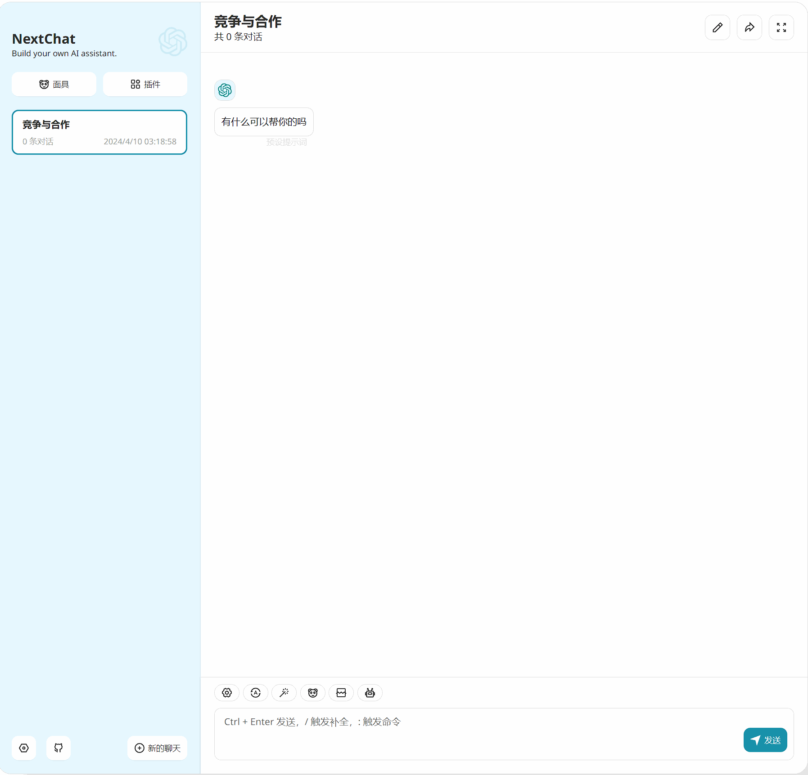
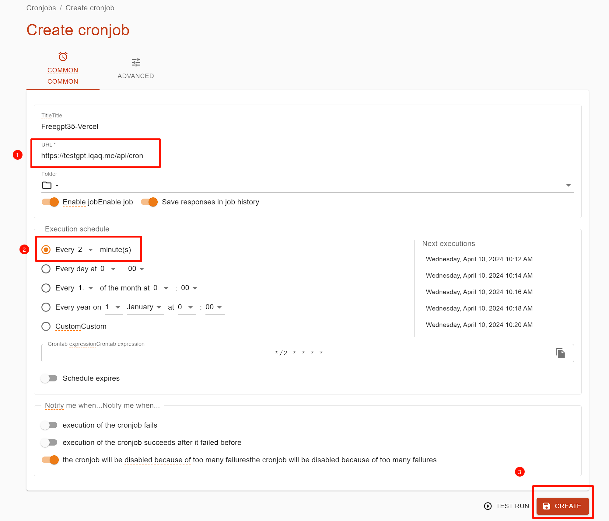
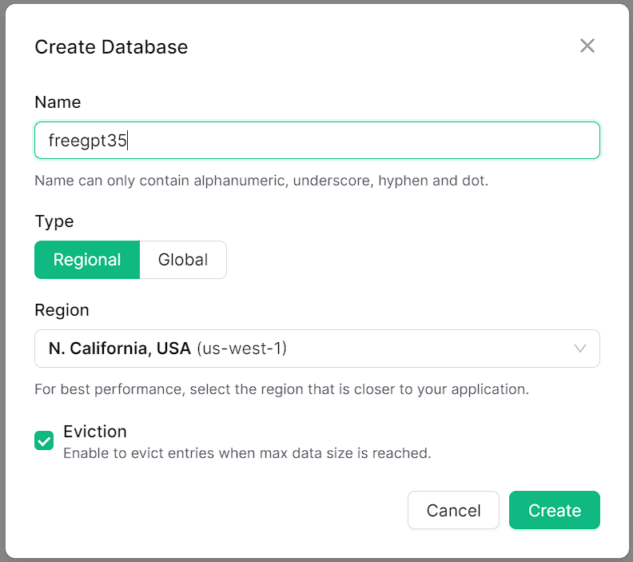
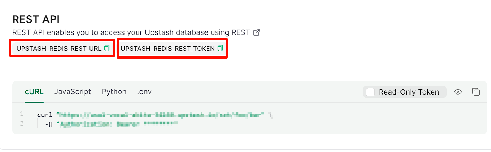
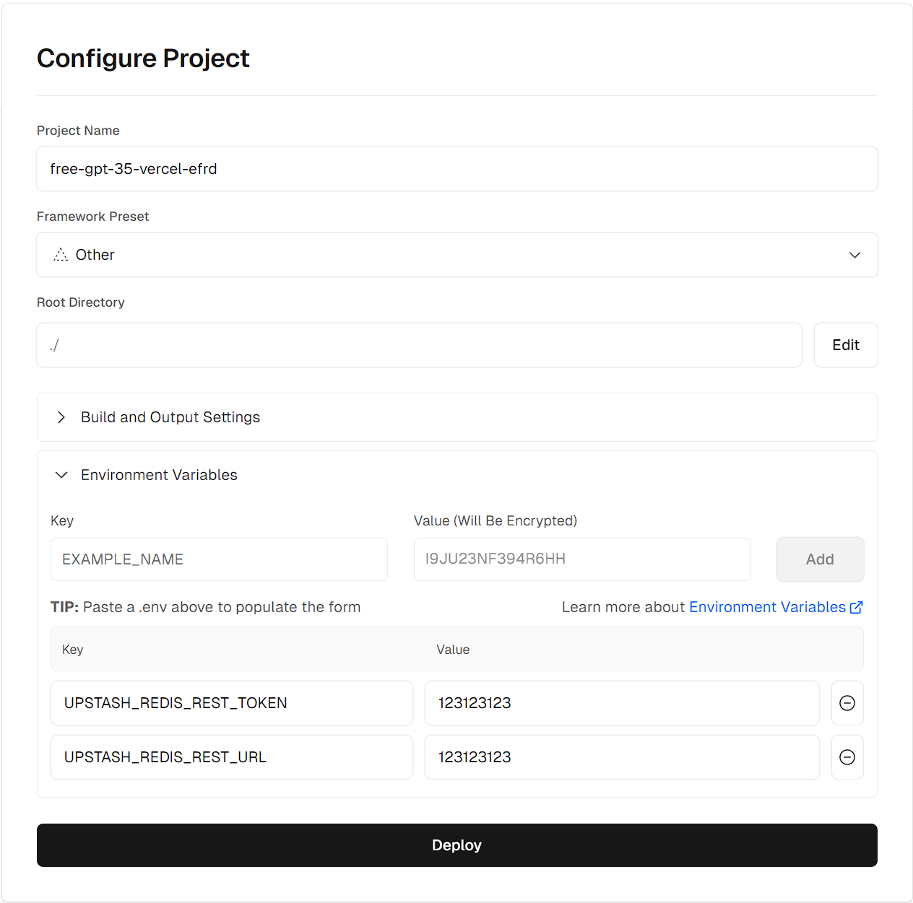
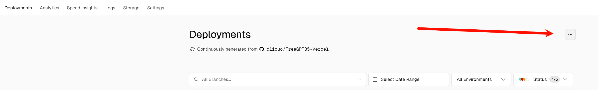

English / [简体中文](./README.md)
# I, Vercel, have been resurrected !!!!!! Supported Streaming Response !!!!!! 
# Concurrency has really improved this time too, I was really wrong before, but this time it really works!
#### Test interface: [https://testgpt.iqaq.me/](https://testgpt.iqaq.me/)
### ChatGPT Next Web Testing: 
#### Online experience: [https://chat.iqaq.me/](https://chat.iqaq.me/)
Of course, I can't send such a long reply in 10s!

#### Still has problems
- Stream breaks after 10s. (Since the Hobby plan of Vercel lasts a maximum of 10 seconds, remember to lower the `maximum text length` to around 600 with 30 concurrency using [immersivetranslation](https://immersivetranslate.com/en/)).
- The refresh of the token requested from OpenAI relies on a timed task, which free users are only given to use once a day...
#### Solution.
- Vercel Pro plan timeout is capped at 300s and comes with a cron plan [skip to Pro deployment introduction](#method-3-vercel-pro-plan-premium-users-remove-10s-max-request-duration-comes-with-cron-jobs).
- Otherwise timed tasks are available via [cron-job](https://console.cron-job.org/) or `Uptime Kuma`, etc. periodically (every 2-4 minutes) by calling `https://[Your_domain]/api/cron`

---------------------
## Vercel deployment button 
**Not recommended, can't synchronise updates**, ~~and the new version requires a database now, clicking on it also still requires a database configuration step~~ **This button currently includes the `Vercel KV` database**, the hobby plan only needs to be paired with a little [cron-job](https://console.cron-job.org/), look at Deploy below! Method 1: Step 8.

[](https://vercel.com/new/clone?repository-url=https%3A%2F%2Fgithub.com%2Fcliouo%2FFreeGPT35-Vercel&skippable-integrations=1&stores=[{"type":"kv"}])


--------------------

## Deploy
#### The following are recommended to bind custom domain names to resolve Vercel's domain name blocking issue
### Method 1: Deploy `KV` database in conjunction with [Vercel](https://vercel.com/) (kv database has only 3k visits per day, 30k visits per month, which is only enough for low-frequency personal use)
1. fork this repository, uncheck `Copy the main branch only` when you fork it.
2. Go to Vercel and import the repository you forked.
3. Click `Deploy` and wait for the deployment to complete.
4. Go to the `Storage` tab and create a `KV` database with a random `Database Name` and `San Francisco` for the `Primary Region`.
5. Make sure that the `Projects` tab of the `KV` database is connected to your project.
6. (Optional) Bind your own domain name under `Domains` in `Settings`.
7. Go to the `Deployments` tab at the top and `Redeploy` to redeploy your project.

8. (Hobby plan users) go to [cron-job](https://console.cron-job.org/) and create a task that refreshes tokens on a regular visit, fill in `https://[Your_domain]/api/cron`, choose every two minutes, `Create` and you're done, there are other similar Uptime Kuma as well.

9. Done! Applause, after the first deployment it is recommended to manually visit `https://[Your_domain]/api/cron` to refresh the token

--------------------

### Method 2: `Redis` database deployment with [Upstash](https://upstash.com/) (10k visits per day) Recommended!
[Official Documentation](https://upstash.com/docs/redis/overall/getstarted)
1. Jump to `Upstash` to create and login to your account to create a `Redis` database
2. For `Region` select `California, USA` as recommended, for `Eviction` tick the box and create a `Redis` database.

3. Pay attention to `UPSTASH_REDIS_REST_URL` and `UPSTASH_REDIS_REST_TOKEN`, we need to copy these two pairs of data name and data value, and these two pairs of data need to be filled in the `Environment Variables` of `Vercel` later.

4. fork this repository, and uncheck `Copy the main branch only` when you fork.
5. Import the forked repository in vercel.
6. In the `Environment Variables` input box, fill in the two pairs of data from step 3.

7. Click `Deploy`.
8. (Optional) Bind your own domain name under `Domains` in `Settings`. 9.
9. Go to the `Deployments` tab at the top and `Redeploy` to redeploy your project.
10. (Same as above 8. Hobby plan users need to set up cron-job.org timed tasks)
11. Done! Applause, after the first deployment it is recommended to manually visit `https://[Your_domain]/api/cron` to refresh the token

--------------------

### Method 3: `Vercel Pro` plan premium users, remove 10s max request duration, comes with cron-jobs
1. the first few steps of deployment are the same as the above two plans, choose according to your needs, and do not need to set up cron schedules.
2. just go to the `Git` page under `Settings` and fill in `vercel-pro` in `Production Branch` and click `Save` before the final `Redeploy` redeployment.

3. Then go to the `Deployments` tab at the top, and be careful not to select any of the already deployed records below!!!! Then click on the three dots in the top right corner of the image `Create Deployment` and select `vercel-pro` and then `Create Deployment`!

4. Done! Applause, after the first deployment it is recommended to manually visit `https://[Your_domain]/api/cron` to refresh the token

--------------------

## Request Example

**You don't have to pass Authorisation, of course, you can also pass any string randomly.**

```bash
curl https://[Your Vercel Domain]/v1/chat/completions \
  -H "Content-Type: application/json" \\
  -H "Authorization: Bearer any_string_you_like" \
  -d '{
    "model": "gpt-3.5-turbo", \ -d '{
    "messages": [
      {
        "role": "user", "content": "Hello!
        "content": "Hello!"
      }
    ], "stream": true
    "stream": true
    }'
```
## Advanced settings
### Environment Variables (don't set these if you don't know what they are for)

| Key | Value | Explanation | Requirement |
|---------------------------|-------------------------------|-----------------------------------------------|-------|
| `AUTH_TOKEN` | You_set_the_apikey_yourself. | The apikey you set for your own interface. | Optional |
| `UPSTASH_REDIS_REST_URL` | Your_Upstash_URL | The URL of your Upstash Redis database | Optional |
| `UPSTASH_REDIS_REST_TOKEN` | Your_Upstash_Token | Your Upstash Redis database's Token | Optional |
### Concurrency tuning
Default timer 4 minutes to update 16 tokens, tokens to determine the concurrency, generally enough, such as the need to adjust the upper limit should be considered in the 10s request time limit to complete the refreshing of tokens (Pro users can plan their own)
## Compatibility

You can use it in any app, such as OpenCat, Next-Chat, Lobe-Chat, Bob, etc. Feel free to fill in an **API Key** with any string, for example, `gptyyds`.

### Bob


## Credits
- Forked From: [https://github.com/missuo/FreeGPT35](https://github.com/missuo/FreeGPT35)
- Higher Upstream: [https://github.com/skzhengkai/free-chatgpt-api](https://github.com/skzhengkai/free-chatgpt-api)
- Original Author: [https://github.com/PawanOsman/ChatGPT](https://github.com/PawanOsman/ChatGPT)
## Similar Project

- [aurora](https://github.com/aurora-develop/aurora): Golang development, support for multiple deployment methods
## Licence
AGPL 3.0 Licence
